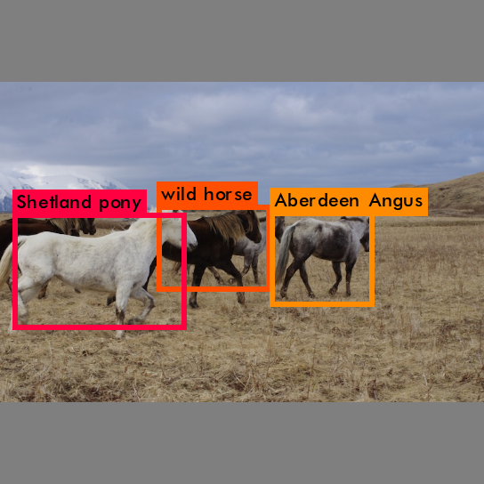

## Real-Time Object Detection with Yolo (State of the art)

<p align="center">
  <br/>
  <i>Scroll down if you want to make your own video.</i>
</p>

## How to get started?

### Ubuntu/Linux
First clone the repository and run the installation script
```
git clone https://github.com/yaselh/rt-yolo.git
cd rt-yolo
source install.sh  # Will compile darknet for CPU. For GPU support, scroll down!
```
The command below outputs the images with the predicted bounding boxes in a folder called "prediction" in the input images directory.
Darknet/cfg and darknet/data contain already the config and meta data files of some known models.
Make sure that you have already downloaded the weights file.
```
./detector.py --imgs_path PATH_TO_IMAGES --weights_path weights/tiny-yolo.weights --cfg_path cfg/tiny-yolo.cfg --data_path cfg/coco.data
 ```

The output should be something like:

```
layer     filters    size              input                output
    0 conv     32  3 x 3 / 1   544 x 544 x   3   ->   544 x 544 x  32
    1 max          2 x 2 / 2   544 x 544 x  32   ->   272 x 272 x  32
    2 conv     64  3 x 3 / 1   272 x 272 x  32   ->   272 x 272 x  64
    3 max          2 x 2 / 2   272 x 272 x  64   ->   136 x 136 x  64
    4 conv    128  3 x 3 / 1   136 x 136 x  64   ->   136 x 136 x 128
    5 conv     64  1 x 1 / 1   136 x 136 x 128   ->   136 x 136 x  64
    6 conv    128  3 x 3 / 1   136 x 136 x  64   ->   136 x 136 x 128
    7 max          2 x 2 / 2   136 x 136 x 128   ->    68 x  68 x 128
    8 conv    256  3 x 3 / 1    68 x  68 x 128   ->    68 x  68 x 256
    9 conv    128  1 x 1 / 1    68 x  68 x 256   ->    68 x  68 x 128
   10 conv    256  3 x 3 / 1    68 x  68 x 128   ->    68 x  68 x 256
   11 max          2 x 2 / 2    68 x  68 x 256   ->    34 x  34 x 256
   12 conv    512  3 x 3 / 1    34 x  34 x 256   ->    34 x  34 x 512
   13 conv    256  1 x 1 / 1    34 x  34 x 512   ->    34 x  34 x 256
   14 conv    512  3 x 3 / 1    34 x  34 x 256   ->    34 x  34 x 512
   15 conv    256  1 x 1 / 1    34 x  34 x 512   ->    34 x  34 x 256
   16 conv    512  3 x 3 / 1    34 x  34 x 256   ->    34 x  34 x 512
   17 max          2 x 2 / 2    34 x  34 x 512   ->    17 x  17 x 512
   18 conv   1024  3 x 3 / 1    17 x  17 x 512   ->    17 x  17 x1024
   19 conv    512  1 x 1 / 1    17 x  17 x1024   ->    17 x  17 x 512
   20 conv   1024  3 x 3 / 1    17 x  17 x 512   ->    17 x  17 x1024
   21 conv    512  1 x 1 / 1    17 x  17 x1024   ->    17 x  17 x 512
   22 conv   1024  3 x 3 / 1    17 x  17 x 512   ->    17 x  17 x1024
   23 conv  28269  1 x 1 / 1    17 x  17 x1024   ->    17 x  17 x28269
   24 detection
Loading weights from darknet/weights/tiny-yolo-weights/tiny-yolo.weights...Done!
data/horses.jpg: Predicted in 7.556429 seconds.
wild horse: 50%
Shetland pony: 84%
Aberdeen Angus: 72%
Not compiled with OpenCV, saving to predictions.png instead
```

The image with the bounding boxes is in `predictions.png`. 

## Examples

`python detector.py cfg/coco.data cfg/tiny-yolo.cfg weights/tiny-yolo.weights data/horses.jpg`
<div align="center">
  <br><br>
</div>

`python video_detector.py`
<p align="center">performs detection from video data (from a webcam per default)</p>

## GPU Support

Make sure that your NVIDIA GPU is properly configured beforehand. `nvcc` should be in the PATH. If not, *something like this* should do the job:

```
export PATH=/usr/local/cuda-8.0/bin:$PATH
export LD_LIBRARY_PATH=/usr/local/cuda-8.0/lib64:$LD_LIBRARY_PATH
```
Let's now compile `darknet` with GPU support!
```
cd darknet
make clean
vim Makefile # Change the first two lines to: GPU=1 and CUDNN=1. You can also use emacs or nano!
make
```

You can also run the command and monitor its status with `nvidia-smi`:
```
+-----------------------------------------------------------------------------+
| NVIDIA-SMI 375.26                 Driver Version: 375.26                    |
|-------------------------------+----------------------+----------------------+
| GPU  Name        Persistence-M| Bus-Id        Disp.A | Volatile Uncorr. ECC |
| Fan  Temp  Perf  Pwr:Usage/Cap|         Memory-Usage | GPU-Util  Compute M. |
|===============================+======================+======================|
|   0  TITAN X (Pascal)    Off  | 0000:02:00.0      On |                  N/A |
| 26%   49C    P2    76W / 250W |   4206MiB / 12189MiB |     10%      Default |
+-------------------------------+----------------------+----------------------+
|   1  TITAN X (Pascal)    Off  | 0000:04:00.0     Off |                  N/A |
| 29%   50C    P8    20W / 250W |      3MiB / 12189MiB |      0%      Default |
+-------------------------------+----------------------+----------------------+
|   2  TITAN X (Pascal)    Off  | 0000:05:00.0     Off |                  N/A |
| 31%   53C    P8    18W / 250W |      3MiB / 12189MiB |      0%      Default |
+-------------------------------+----------------------+----------------------+
|   3  TITAN X (Pascal)    Off  | 0000:06:00.0     Off |                  N/A |
| 29%   50C    P8    22W / 250W |      3MiB / 12189MiB |      0%      Default |
+-------------------------------+----------------------+----------------------+

+-----------------------------------------------------------------------------+
| Processes:                                                       GPU Memory |
|  GPU       PID  Type  Process name                               Usage      |
|=============================================================================|
|    0     30782    C   ./darknet                                     3991MiB |
+-----------------------------------------------------------------------------+
```
Here, we can see that our process `darknet` is running on the first GPU.

**NOTE**: We highly recommend a recent GPU with 8GB (or more) of memory to run flawlessly. GTX 1070, GTX 1080 Ti or Titan X are a great choice!

```
By default the threshold is set to 0.5. It means that Yolo displays the bounding boxes of elements with a 50%+ confidence. In practice, a lower threshold means more detected items (but also more errors).
